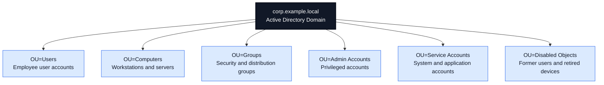
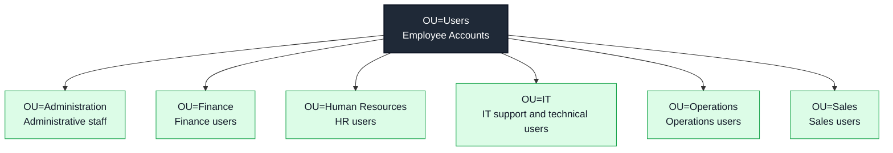
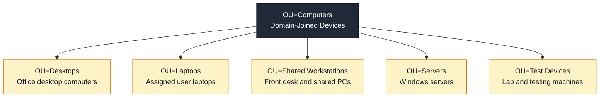
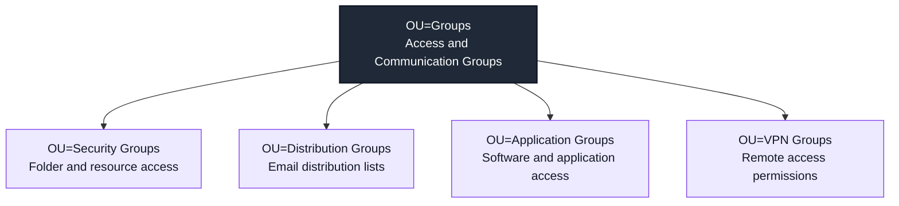
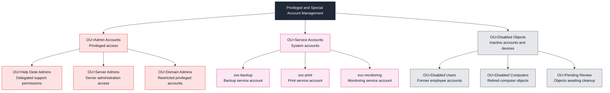

# Active Directory OU Structure Diagram

## Purpose

This document shows a professional Active Directory Organizational Unit structure for an IT support lab. Instead of using one large diagram that becomes too small on GitHub, this version separates the design into smaller readable diagrams.

---

# 1. High-Level Active Directory Structure

## What This Shows

This high-level structure separates users, computers, groups, admin accounts, service accounts, and disabled objects. This makes Active Directory easier to manage, troubleshoot, and document.

---

# 2. Users OU Structure

## Support Use Cases

| Scenario               | OU Location                   |
| ---------------------- | ----------------------------- |
| New finance employee   | `OU=Users/OU=Finance`         |
| New IT support user    | `OU=Users/OU=IT`              |
| HR employee account    | `OU=Users/OU=Human Resources` |
| Sales employee account | `OU=Users/OU=Sales`           |

---

# 3. Computers OU Structure

## Support Use Cases

| Scenario             | OU Location                           |
| -------------------- | ------------------------------------- |
| New staff laptop     | `OU=Computers/OU=Laptops`             |
| Office desktop       | `OU=Computers/OU=Desktops`            |
| Shared front desk PC | `OU=Computers/OU=Shared Workstations` |
| Lab testing device   | `OU=Computers/OU=Test Devices`        |

---

# 4. Groups OU Structure

## Support Use Cases

| Scenario                   | OU Location                        |
| -------------------------- | ---------------------------------- |
| Shared folder access       | `OU=Groups/OU=Security Groups`     |
| Department email list      | `OU=Groups/OU=Distribution Groups` |
| Application access request | `OU=Groups/OU=Application Groups`  |
| VPN access request         | `OU=Groups/OU=VPN Groups`          |

---

# 5. Admin, Service, and Disabled Account Structure

## Support Use Cases

| Scenario                  | Recommended Location                        |
| ------------------------- | ------------------------------------------- |
| Help desk delegated admin | `OU=Admin Accounts/OU=Help Desk Admins`     |
| Backup service account    | `OU=Service Accounts`                       |
| Departed employee         | `OU=Disabled Objects/OU=Disabled Users`     |
| Retired workstation       | `OU=Disabled Objects/OU=Disabled Computers` |
| Account pending review    | `OU=Disabled Objects/OU=Pending Review`     |

---

# Why This Structure Is Professional

This OU structure is useful because it separates different account and device types. It also supports better onboarding, offboarding, access control, security review, and help desk troubleshooting.

## Best Practices Demonstrated

* Keep standard user accounts separate from admin accounts.
* Keep service accounts separate from employee accounts.
* Organize users by department.
* Organize computers by device type.
* Use groups for permissions and access control.
* Move disabled users and retired devices into a separate OU.
* Document account changes in a ticket.
* Follow least privilege for admin access.

## Portfolio Note

This diagram is part of an Active Directory and Windows Server lab designed to demonstrate IT Support, Service Desk, Desktop Support, and Junior Systems Administrator documentation skills.

## Disclaimer

This is a sample lab diagram for learning and portfolio purposes. Real organizations may use different OU naming standards, Group Policy designs, security models, and administrative procedures.
