# Active Directory OU Structure Diagram

## Purpose

This diagram shows a professional sample Active Directory Organizational Unit structure for an IT support lab. It demonstrates how user accounts, computers, groups, administrative accounts, service accounts, and disabled objects can be organized in a clean Windows Server environment.

```mermaid
flowchart TB
    ROOT["corp.example.local<br/>Active Directory Domain"]

    ROOT --> USERS["OU=Users<br/>Standard employee user accounts"]
    ROOT --> COMPUTERS["OU=Computers<br/>Domain-joined workstations and servers"]
    ROOT --> GROUPS["OU=Groups<br/>Security and distribution groups"]
    ROOT --> ADMINS["OU=Admin Accounts<br/>Privileged and delegated admin accounts"]
    ROOT --> SERVICE["OU=Service Accounts<br/>Application and system service accounts"]
    ROOT --> DISABLED["OU=Disabled Objects<br/>Former users and retired devices"]

    USERS --> USERS_DEPT["Department Users"]
    USERS_DEPT --> U_ADMIN["OU=Administration<br/>Administrative staff"]
    USERS_DEPT --> U_FIN["OU=Finance<br/>Finance users"]
    USERS_DEPT --> U_HR["OU=Human Resources<br/>HR users"]
    USERS_DEPT --> U_IT["OU=IT<br/>IT support users"]
    USERS_DEPT --> U_OPS["OU=Operations<br/>Operations users"]
    USERS_DEPT --> U_SALES["OU=Sales<br/>Sales users"]

    COMPUTERS --> COMP_TYPE["Device Type"]
    COMP_TYPE --> C_DESKTOPS["OU=Desktops<br/>Office desktop computers"]
    COMP_TYPE --> C_LAPTOPS["OU=Laptops<br/>Assigned user laptops"]
    COMP_TYPE --> C_SHARED["OU=Shared Workstations<br/>Front desk and shared PCs"]
    COMP_TYPE --> C_SERVERS["OU=Servers<br/>Windows servers"]
    COMP_TYPE --> C_TEST["OU=Test Devices<br/>Lab and testing machines"]

    GROUPS --> G_ACCESS["Access Control Groups"]
    G_ACCESS --> G_SECURITY["OU=Security Groups<br/>Folder, app, and resource access"]
    G_ACCESS --> G_DISTRIBUTION["OU=Distribution Groups<br/>Email distribution lists"]
    G_ACCESS --> G_APP["OU=Application Groups<br/>Business application access"]
    G_ACCESS --> G_VPN["OU=VPN Groups<br/>Remote access users"]

    ADMINS --> A_STANDARD["OU=Help Desk Admins<br/>Delegated support permissions"]
    ADMINS --> A_SERVER["OU=Server Admins<br/>Server administration access"]
    ADMINS --> A_DOMAIN["OU=Domain Admins<br/>Restricted privileged accounts"]

    SERVICE --> S_BACKUP["svc-backup<br/>Backup service account"]
    SERVICE --> S_PRINT["svc-print<br/>Print service account"]
    SERVICE --> S_MONITOR["svc-monitoring<br/>Monitoring service account"]
    SERVICE --> S_APP["svc-application<br/>Application service account"]

    DISABLED --> D_USERS["OU=Disabled Users<br/>Former employee accounts"]
    DISABLED --> D_COMPUTERS["OU=Disabled Computers<br/>Retired computer objects"]
    DISABLED --> D_REVIEW["OU=Pending Review<br/>Objects awaiting cleanup"]

    classDef domain fill:#111827,stroke:#030712,color:#ffffff,stroke-width:2px;
    classDef primary fill:#dbeafe,stroke:#2563eb,color:#111827,stroke-width:1px;
    classDef users fill:#dcfce7,stroke:#16a34a,color:#111827,stroke-width:1px;
    classDef computers fill:#fef3c7,stroke:#d97706,color:#111827,stroke-width:1px;
    classDef groups fill:#ede9fe,stroke:#7c3aed,color:#111827,stroke-width:1px;
    classDef admins fill:#fee2e2,stroke:#dc2626,color:#111827,stroke-width:1px;
    classDef service fill:#fce7f3,stroke:#db2777,color:#111827,stroke-width:1px;
    classDef disabled fill:#e5e7eb,stroke:#4b5563,color:#111827,stroke-width:1px;

    class ROOT domain;
    class USERS,COMPUTERS,GROUPS,ADMINS,SERVICE,DISABLED primary;
    class USERS_DEPT,U_ADMIN,U_FIN,U_HR,U_IT,U_OPS,U_SALES users;
    class COMP_TYPE,C_DESKTOPS,C_LAPTOPS,C_SHARED,C_SERVERS,C_TEST computers;
    class G_ACCESS,G_SECURITY,G_DISTRIBUTION,G_APP,G_VPN groups;
    class A_STANDARD,A_SERVER,A_DOMAIN admins;
    class S_BACKUP,S_PRINT,S_MONITOR,S_APP service;
    class D_USERS,D_COMPUTERS,D_REVIEW disabled;
```

## What This Diagram Demonstrates

* Active Directory domain organization
* Department-based user account structure
* Computer account separation by device type
* Security group organization
* Distribution group organization
* VPN and application access grouping
* Admin account separation
* Service account separation
* Disabled account management
* Basic Windows Server administration documentation

## Why This OU Structure Is Useful

A clean OU structure helps IT support teams manage accounts, devices, access, and troubleshooting more effectively. It also supports better onboarding, offboarding, Group Policy planning, access control, and account review processes.

## Example Help Desk Use Cases

| Scenario                     | Recommended OU Area                         |
| ---------------------------- | ------------------------------------------- |
| New employee account         | `OU=Users` under the correct department     |
| New company laptop           | `OU=Computers/OU=Laptops`                   |
| Shared front desk computer   | `OU=Computers/OU=Shared Workstations`       |
| Shared folder access request | `OU=Groups/OU=Security Groups`              |
| VPN access request           | `OU=Groups/OU=VPN Groups`                   |
| Business application access  | `OU=Groups/OU=Application Groups`           |
| Help desk delegated admin    | `OU=Admin Accounts/OU=Help Desk Admins`     |
| Backup system account        | `OU=Service Accounts`                       |
| Departed employee account    | `OU=Disabled Objects/OU=Disabled Users`     |
| Retired workstation          | `OU=Disabled Objects/OU=Disabled Computers` |

## Support Notes

* Standard users should be separated from admin accounts.
* Service accounts should not be mixed with regular user accounts.
* Disabled accounts should be moved to a dedicated disabled OU.
* Security groups should be used for access instead of assigning permissions directly to individual users.
* Computer accounts should be organized by device type or location.
* All account changes should be documented in a help desk ticket.
* Privileged access should require approval and follow least privilege.

## Portfolio Note

This diagram is part of an Active Directory and Windows Server lab designed to demonstrate IT Support, Service Desk, Desktop Support, and Junior Systems Administrator documentation skills.

## Disclaimer

This is a sample lab diagram for learning and portfolio purposes. Real organizations may use different OU naming standards, Group Policy designs, security models, and administrative procedures.
